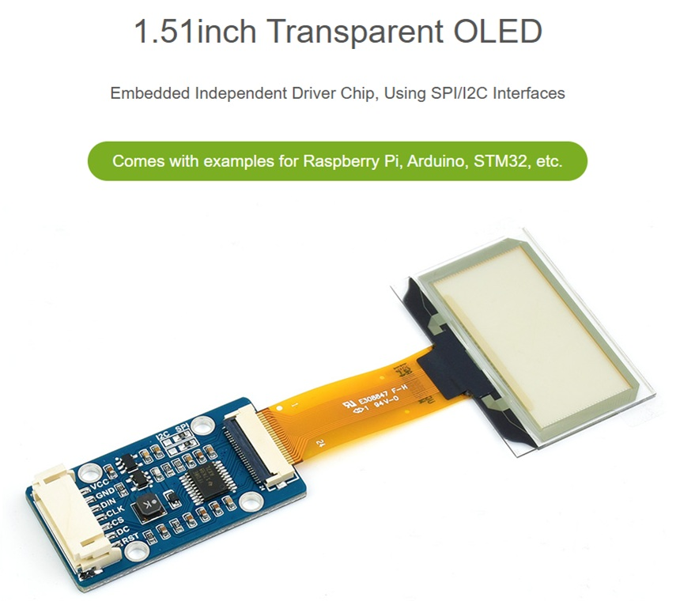
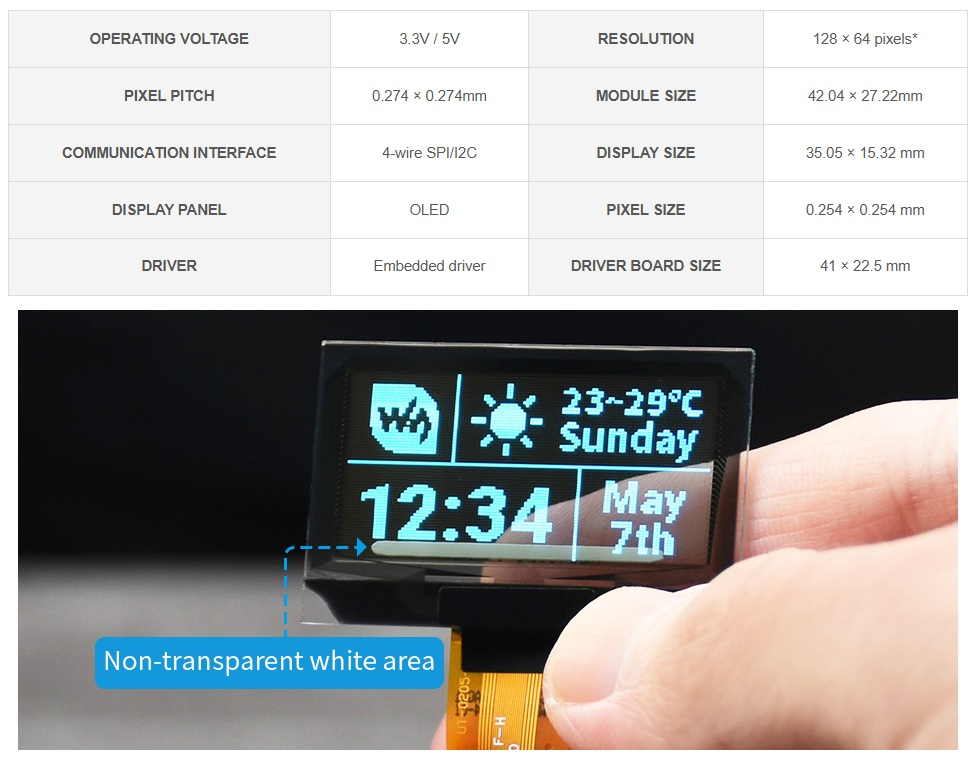
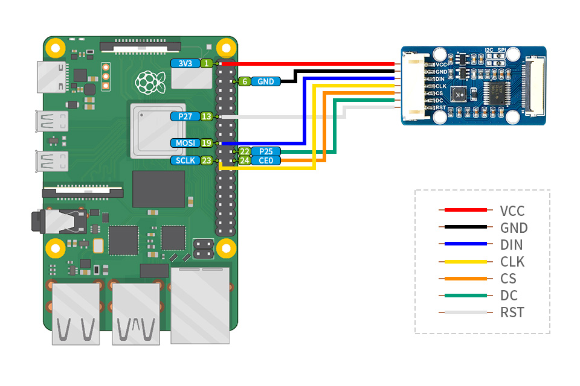
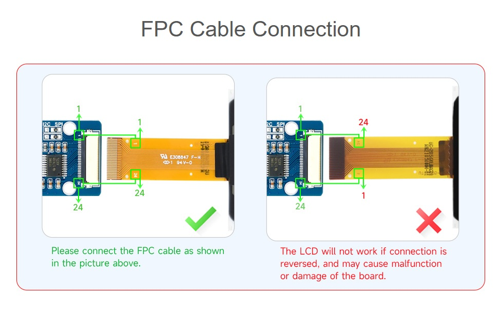
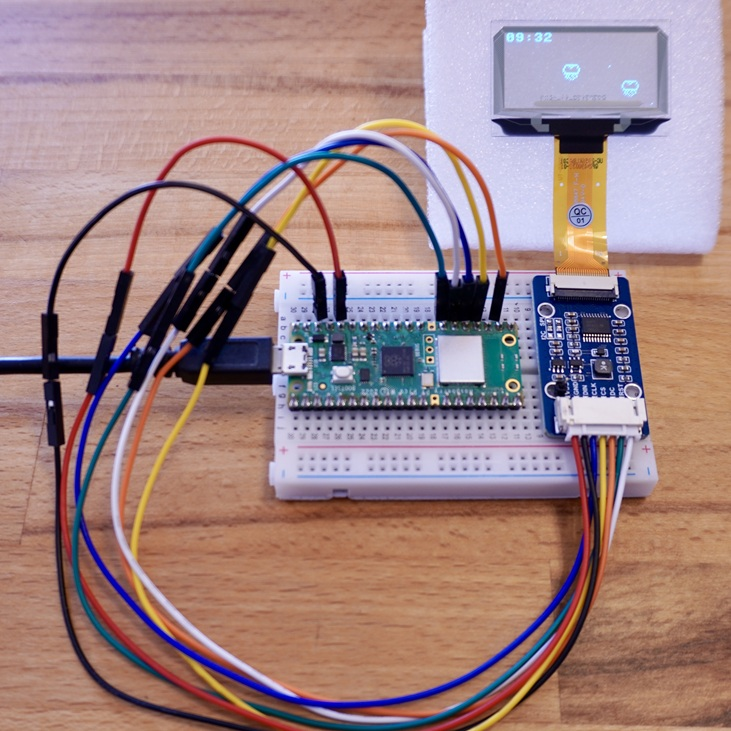
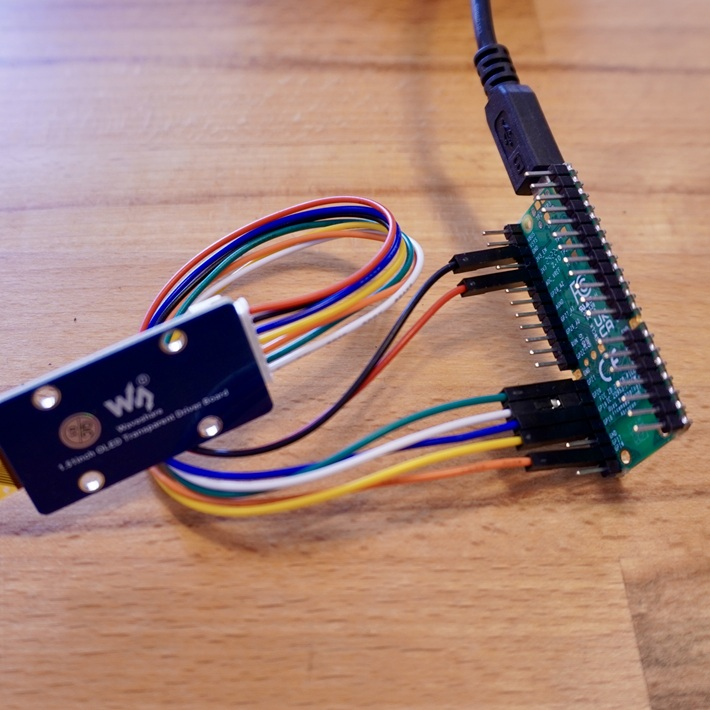
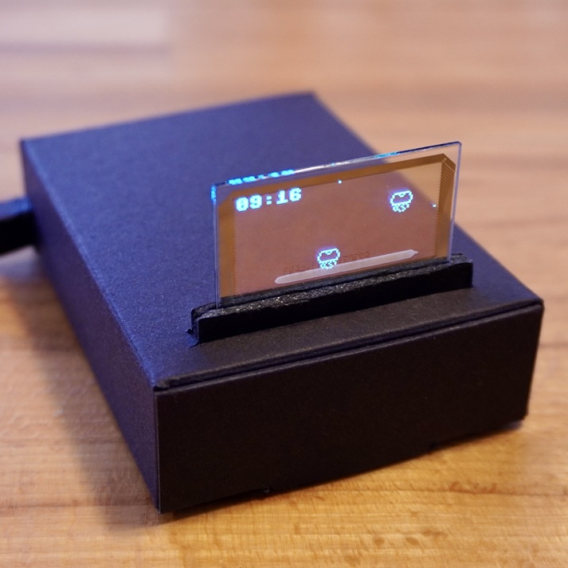

<a name="readme-top"></a>

<!-- ABOUT THE PROJECT -->

# 1. プロジェクトについて

Raspberry Pi Pico の 4-wire SPI を使って 1.51 インチの透明 OLED「1.51inch Transparent OLED」へ画像を表示するプロジェクトです。




Waveshare から提供されているサンプルコード「OLED_1in51_test.py」をベースに作成しています。

https://files.waveshare.com/upload/2/2c/OLED_Module_Code.7z

サンプルコードのパスは以下です。これを Raspberry Pi Pico で動くように変更しています。

```
OLED_Module_Code/RaspberryPi/python/example
```

<p align="right">(<a href="#readme-top">back to top</a>)</p>

# 2. 配線図





| OLED      | Color  | Pico |
| --------- | ------ | ---- |
| VCC       | red    | 3V3  |
| GND       | black  | GND  |
| DIN(MOSI) | blue   | GP19 |
| CLK       | yellow | GP18 |
| CS        | orange | GP17 |
| DC        | green  | GP21 |
| RST       | white  | GP20 |

Raspberry Pi Pico のピンに直接接続しても良いです。



<p align="right">(<a href="#readme-top">back to top</a>)</p>

# 3. 環境構築

1. MicroPython を使用するため、下段の「Getting started with your Raspberry Pi Pico W」を参考に、環境を構築する
1. src のファイルを Raspberry Pi Pico W へコピーする
1. Wi-Fi 接続のため、main.py の SSID と PASSWORD を変更する

```python
SSID = "your-ssid"
PASSWORD = "your-password"
```

<p align="right">(<a href="#readme-top">back to top</a>)</p>

# 4. 参考

透明 OLED についてもっと知りたい方、他の設定も知りたい方は Manual を参照ください。

- [Raspberry Pi Documentation](https://www.raspberrypi.com/documentation/microcontrollers/pico-series.html)
- [Getting started with your Raspberry Pi Pico W](https://projects.raspberrypi.org/en/projects/get-started-pico-w)
- [Raspberry Pi Getting started](https://www.raspberrypi.com/documentation/computers/getting-started.html)
- [1.51inch Transparent OLED](https://www.waveshare.com/1.51inch-transparent-oled.htm)
- [1.51inch Transparent OLED Manual](https://www.waveshare.com/wiki/1.51inch_Transparent_OLED)

<p align="right">(<a href="#readme-top">back to top</a>)</p>

# 5. 画像



<p align="right">(<a href="#readme-top">back to top</a>)</p>
