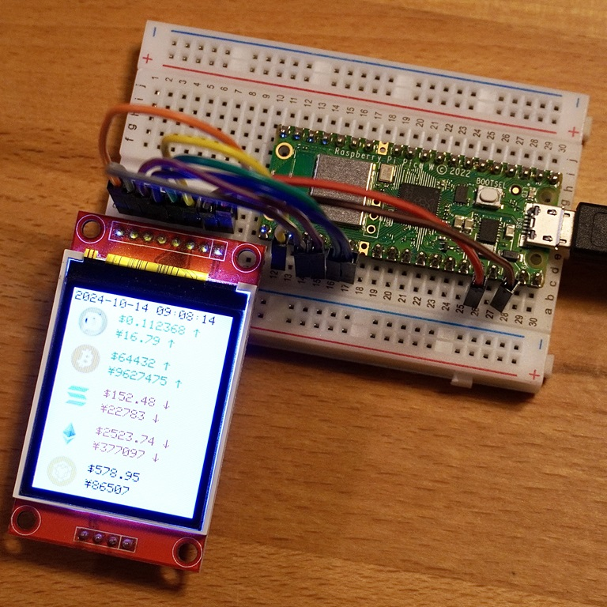
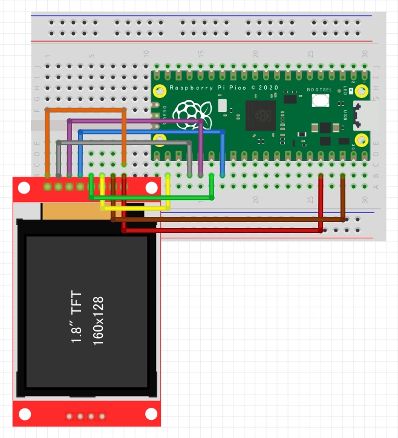

<a name="readme-top"></a>

<!-- ABOUT THE PROJECT -->

# 1. プロジェクトについて

Raspberry Pi Pico W の WiFi を使って CoinGecko API でビットコインの価格を取得し、  
TFT 液晶ディスプレイの ST7735 へ表示するプロジェクトです。MicroPython を使用しています。

矢印「↑ ↓」や円マーク「￥」を表示するために sysfont.py の「< >」「\」のフォントデータを変更しています。  
オリジナルファイルは origin フォルダにあります。



無料の CoinGecko API は API の呼び出し回数制限がありますので、
秒単位で価格を取得したい場合には有料会員になる必要があります。  
詳細は公式ページで確認ください。

CoinGecko API Documentation  
https://docs.coingecko.com/v3.0.1/reference/introduction

本プロジェクトでは 1 分周期で価格を取得しますが、5 分置き程度にしか価格は更新されないようです。

<p align="right">(<a href="#readme-top">back to top</a>)</p>

# 2. Pin connections



| TFT       | Pico | Color  |
| --------- | ---- | ------ |
| LED       | 3V3  | orange |
| SCK       | GP18 | gray   |
| SDI(MOSI) | GP19 | purple |
| DC        | GP21 | blue   |
| RESET     | GP20 | green  |
| CS        | GP17 | yellow |
| GND       | GND  | brown  |
| VCC       | 3V3  | red    |

<p align="right">(<a href="#readme-top">back to top</a>)</p>

# 3. 環境構築

1. MicroPython を使用するため、下段の「Getting started with your Raspberry Pi Pico W」を参考に、環境を構築する
1. src のファイルを Raspberry Pi Pico W へコピーする
1. Wi-Fi 接続のため、main.py の SSID と PASSWORD を変更する

```python
SSID = "your-ssid"
PASSWORD = "your-password"
```

<p align="right">(<a href="#readme-top">back to top</a>)</p>

# 4. 参考

- [Raspberry Pi Documentation](https://www.raspberrypi.com/documentation/microcontrollers/pico-series.html)
- [Getting started with your Raspberry Pi Pico W](https://projects.raspberrypi.org/en/projects/get-started-pico-w)
- [CoinGecko API Documentation](https://docs.coingecko.com/v3.0.1/reference/introduction)

<p align="right">(<a href="#readme-top">back to top</a>)</p>
