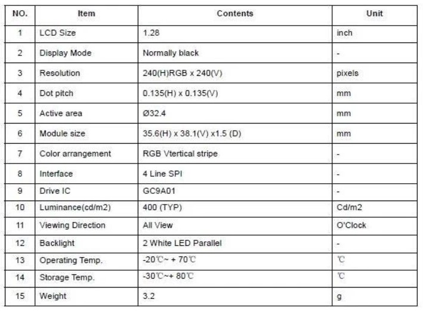

<!-- ABOUT THE PROJECT -->

# 1. プロジェクトについて

Raspberry Pi Pico で 1.28 インチの丸型ディスプレイの GC9A01 へ画像を表示する MicroPython のプロジェクトです。  
Russ Hughes が公開している gc9a01_mpy を使用して、画像を表示しています。ありがとう。

## 1.1. GC9A01 Display Driver for MicroPython

https://github.com/russhughes/gc9a01_mpy

MicroPython で画像を表示できるファームウェアとサンプルソースが公開されています。  
詳細はこちらから確認ください。  
文字を表示するサンプルソース（examples/RP2/mono_fonts）などもあります。

(<a href="#readme-top">back to top</a>)

# 2. 1.28 インチ IPS カラー LCD ディスプレイ

(<a href="#readme-top">back to top</a>)

# 3. Pin connections

| Pico Pin  | Display |
| --------- | ------- |
| 14 (GP10) | BL      |
| 15 (GP11) | RST     |
| 16 (GP12) | DC      |
| 17 (GP13) | CS      |
| 18 (GND)  | GND     |
| 19 (GP14) | CLK     |
| 20 (GP15) | DIN     |

(<a href="#readme-top">back to top</a>)

# 4. 環境構築

1. Raspberry Pi Pico へ firmware.uf2 を書き込む
1. Raspberry Pi Pico とディスプレイを接続する
1. Raspberry Pi Pico へ src をコピー
1. 地球と紅葉の画像が交互に表示されます

※firmware.uf2 は更新されている可能性があります。最新ファイルを使用したい場合には Russ Hughes のページから取得ください。

# 5. 参考

- [Raspberry Pi Documentation](https://www.raspberrypi.com/documentation/microcontrollers/raspberry-pi-pico.html)
- [Getting started with Raspberry Pi Pico](https://projects.raspberrypi.org/en/projects/getting-started-with-the-pico/)
- [GC9A01 Display Driver for MicroPython](https://github.com/russhughes/gc9a01_mpy)

(<a href="#readme-top">back to top</a>)

