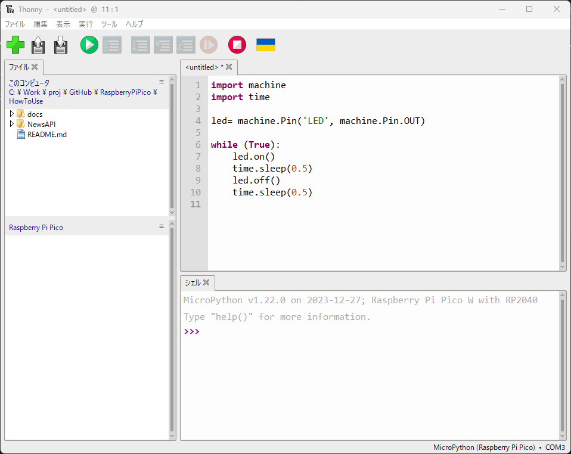
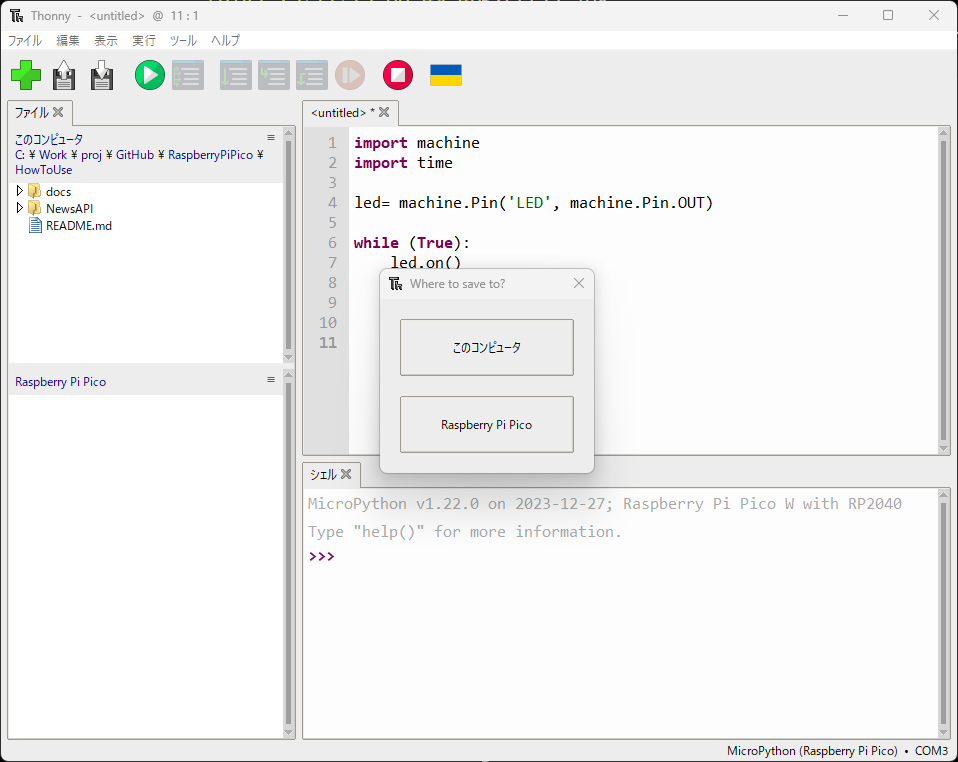
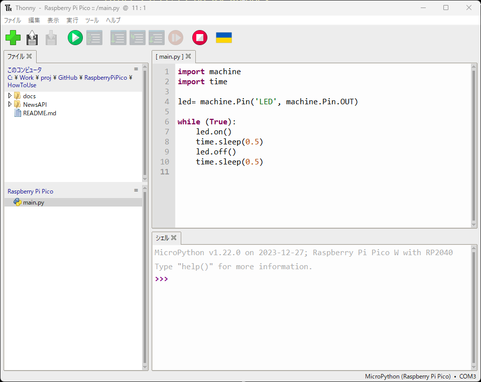

<a name="readme-top"></a>

<!-- ABOUT THE PROJECT -->

# 1. プロジェクトについて

Raspberry Pi Pico W の使い方が分かるプロジェクトです。  
ここでは、Raspberry Pi Pico W についている LED を光らせることと、  
液晶ディスプレイの ST7735 へ画像を表示させることができるようになります。

プログラミング言語は MicroPython です。

まずは、Raspberry Pi Pico W を使えるようにするために、  
Thonny という初心者向けに設計された Python 用の無料のオープンソース統合開発環境のインストールと、  
Raspberry Pi Pico W 用のファームウェアの書き込みを行います。

あと、Raspberry Pi Pico W を使用するには、USB マイクロ B ケーブルが必要です。


<p align="right">(<a href="#readme-top">back to top</a>)</p>

# 2. Thonny のインストール

Thonny のインストールは公式ページを参考にしてください。  
ページの真ん中の「Install Thonny +」をクリックすると、インストールの手順が書かれています。  
Windows にインストールする場合は「Install Thonny on other operating systems」です。

・Set up your Raspberry Pi Pico W  
https://projects.raspberrypi.org/en/projects/get-started-pico-w

英語なので、ブラウザで日本語に翻訳して読んでください。

統合環境をインストールしたことある方は、Thonny のページから初めても良いです。

・Thonny  
https://thonny.org/

<p align="right">(<a href="#readme-top">back to top</a>)</p>

# 3. ファームウェアの書き込み

ファームウェアの書き込みも公式ページを参考にしてください。上記の次のページです。  
ページの真ん中「Debug:」手前まで対応するとファームウェアの書き込みは完了です。

・Set up your Raspberry Pi Pico W  
https://projects.raspberrypi.org/en/projects/get-started-pico-w/1

英語なので、ブラウザで日本語に翻訳して読んでください。

<p align="right">(<a href="#readme-top">back to top</a>)</p>

# 4. L チカ（LED を光らせよう）

ここでは電子工作の基本 L チカを行います。以下の手順を実施ください。

- USB ケーブルと Raspberry Pi Pico W を接続します。
- Thonny を起動します。
- 左上の＋ボタンを押して、プログラムが書けるようにします。
- 以下のプログラムをコピーします。

```python
import machine
import time

led= machine.Pin('LED', machine.Pin.OUT)

while (True):
    led.on()
    time.sleep(0.5)
    led.off()
    time.sleep(0.5)
```



- 左上 3 番目の保存アイコンを押してプログラムを保存します。
- 保存先は「Raspberry Pi Pico」を選択します。
- 適当なファイル名（例えば main.py）を入力します。



- Raspberry Pi Pico に保存されたファイルを選択します。
- 左上 4 番目の実行アイコンを押してプログラムを実行します。



LED が 1 秒周期で点滅すれば成功です！プログラムの世界へようこそ。

<p align="right">(<a href="#readme-top">back to top</a>)</p>

# 5. 参考

Raspberry Pi の公式ドキュメントです。

- [Raspberry Pi Documentation](https://www.raspberrypi.com/documentation/microcontrollers/raspberry-pi-pico.html)
- [Getting started with your Raspberry Pi Pico W](https://projects.raspberrypi.org/en/projects/get-started-pico-w)

<p align="right">(<a href="#readme-top">back to top</a>)</p>
