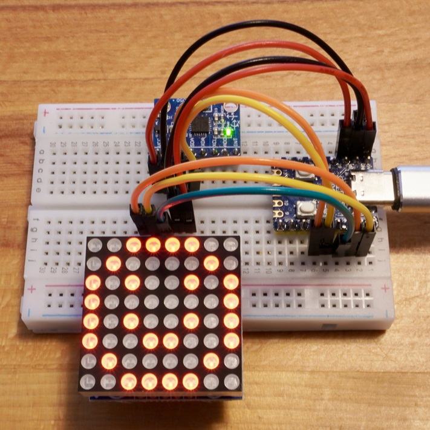

<!-- ABOUT THE PROJECT -->

# 1. プロジェクトについて

RP2040-Zero を対象としたプロジェクトです。  
Adafruit の PixelDust で表示したデジタルの砂を、  
加速度センサー MPU6050 モジュールから取得した傾きを使って動かすことができるスケッチです。

X のサンプル動画 https://x.com/teatree18841627/  
docs フォルダにある動画ファイル C0032.MP4 も参照ください。

また、本プログラムは以下のライブラリを使用しています。ありがとう。

- Adafruit の PixelDust Library
- Eberhard Fahle の LedControl Library

(<a href="#readme-top">back to top</a>)

<!-- USAGE EXAMPLES -->

# 2. Arduino IDE

Arduino IDE の環境構築を行います。バージョンは 2.3.2 を使用しています。
ライブラリは動作確認ができているバージョンです。

- ボードマネージャの追加
  - [ファイル>基本設定>追加のボードマネージャ]：[RP2040 の json](https://github.com/earlephilhower/arduino-pico/releases/download/global/package_rp2040_index.json) を追加
  - [ツール>ボード>ボードマネージャ]：「Raspberry Pi Pico/RP2040」をインストール
- ボードマネージャの選択
  - [ツール>ボード]：「Raspberry Pi Pico/RP2040」の「Waveshare RP2040 Zero」を選択
- ライブラリのインストール
  - [ライブラリマネージャ]：以下のライブラリをインストール
    - MPU6050 by Electronic Cats 1.3.0

(<a href="#readme-top">back to top</a>)

# 3. 配線図

## 3.1. RP2040-Zero

## 3.2. Max7219 & MPU6050

| Max7219 | RP2040-Zero |     | MPU6050 | RP2040-Zero |
| ------- | ----------- | --- | ------- | ----------- |
| VCC     | GND         |     | VCC     | 3.3V        |
| GND     | 5V          |     | GND     | GND         |
| DIN     | GPIO 3      |     | SCL     | GPIO 5      |
| CS      | GPIO 1      |     | SDA     | GPIO 6      |
| CLK     | GPIO 2      |     |         |             |

Max7219 ドットマトリックスモジュールは動作電圧が 5V、  
MPU6050 モジュールは動作電圧が 3.3V ですので、ご注意ください。

(<a href="#readme-top">back to top</a>)

# 4. 参考

- [Arduino IDE](https://www.arduino.cc/en/software)
- [RP2040-Zero](https://www.waveshare.com/wiki/RP2040-Zero)
- [Adafruit_PixelDust（デジタル砂を表示するためのライブラリ）](https://github.com/adafruit/Adafruit_PixelDust)
- [MPU6050 by Electronic Cats（I2C ライブラリを用いた MPU6050 を使用するためのライブラリ）](https://github.com/ElectronicCats/mpu6050/tree/master)
- [LedControl Library（Max7219 デバイスを使用するためのライブラリ）](https://github.com/wayoda/LedControl)

(<a href="#readme-top">back to top</a>)

