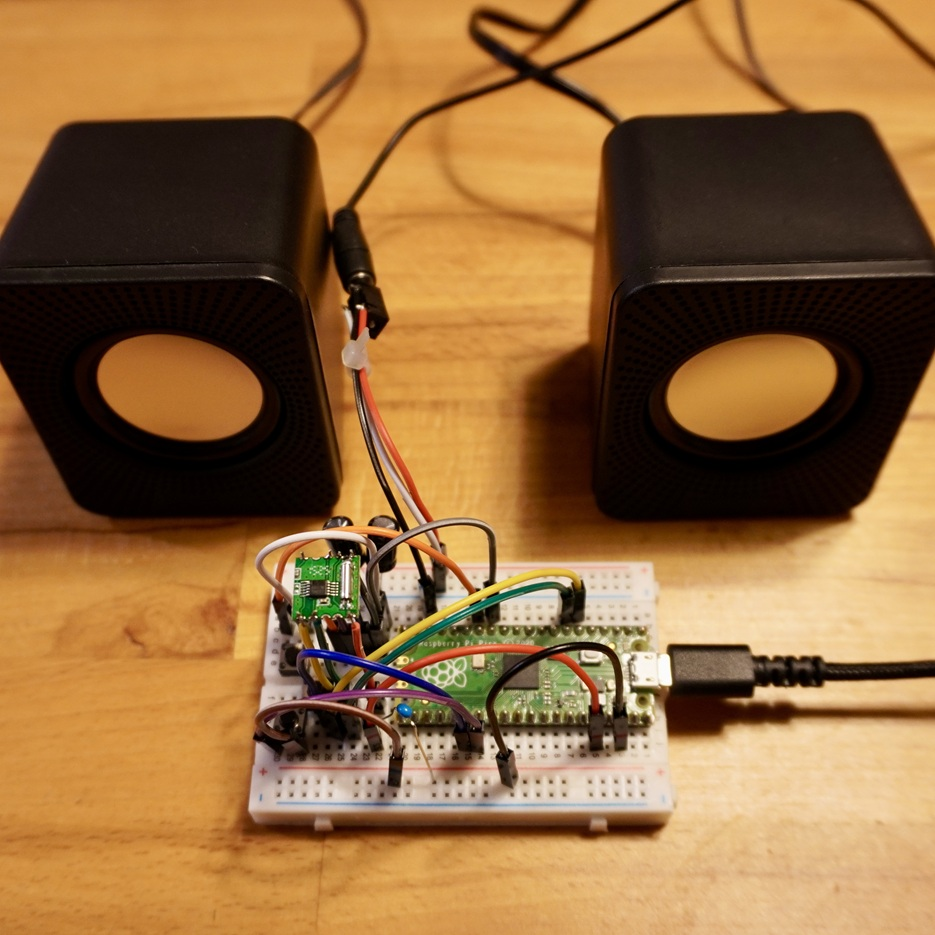
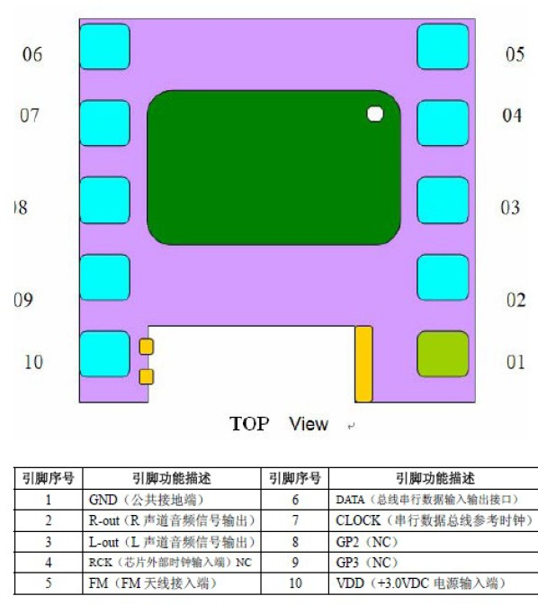
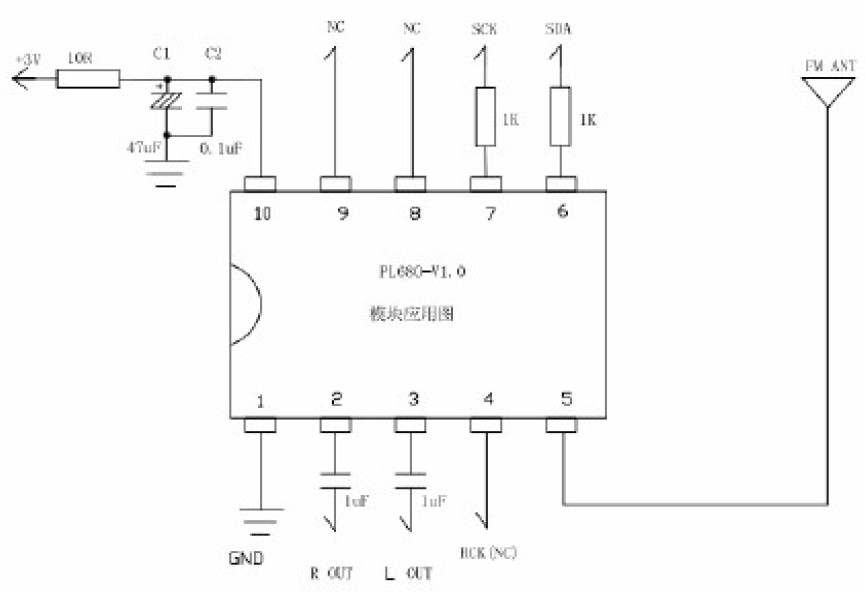
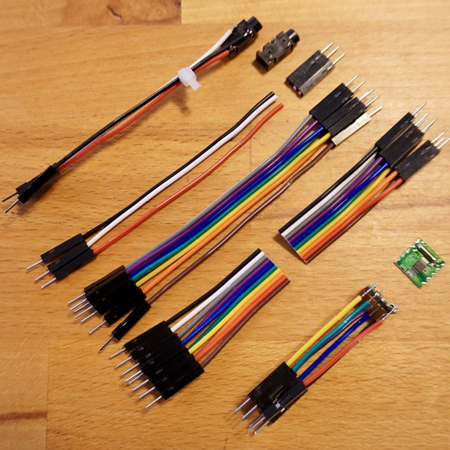
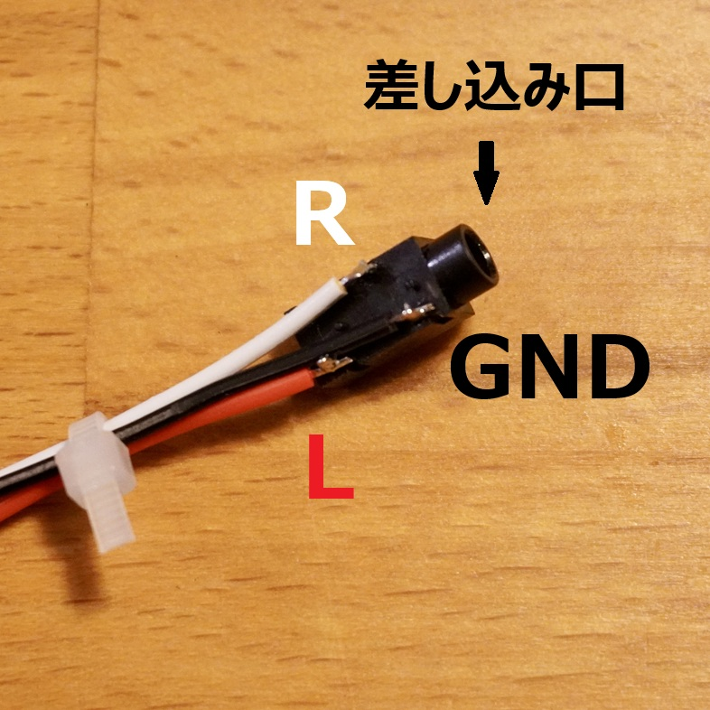
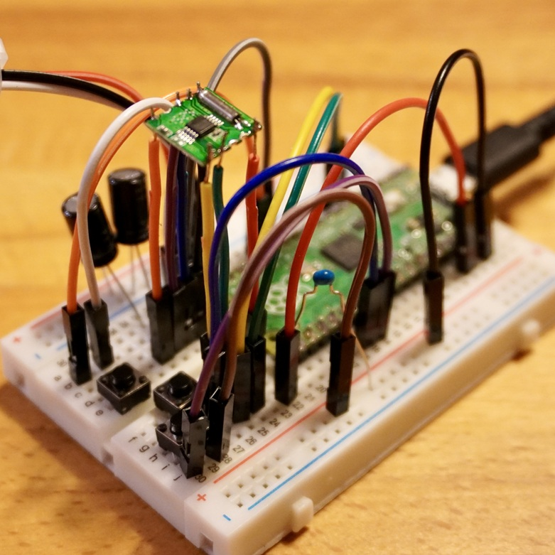

<!-- ABOUT THE PROJECT -->

# 1. プロジェクトについて

Raspberry Pi Pico で FM ラジオモジュール RDA5807M を制御して、FM ラジオを聴くためのプロジェクトです。  
Raspberry Pi Pico は Arduino として動かしており、下記の Arduino 用のライブラリ Radio を使用しています。

Radio https://github.com/mathertel/Radio

プログラムは examples にある TestRDA5807M.ino をベースに作成しています。

## 1.1. Arduino Radio Library

ライブラリについて詳細まで知りたい時は参考にしてください。  
https://www.mathertel.de/Arduino/Radio

(<a href="#readme-top">back to top</a>)

# 2. FM ラジオモジュール RDA5807M

RDA5807M のピン配置と回路図です。詳細な仕様は docs フォルダにある rda5807.pdf を参照ください。

(<a href="#readme-top">back to top</a>)

# 3. Pin connections

| Pico     | RDA5807M |     | Pico      | Button |
| -------- | -------- | --- | --------- | ------ |
| 13 (GND) | 1.GND    |     | 14 (GP10) | UP     |
| -        | 2.R-out  |     | 26 (GP20) | DOWN   |
| -        | 3.L-out  |     | 27 (GP21) | MODE   |
| -        | 5.FM     |     | -         | -      |
| 6 (GP4)  | 6.DATA   |     | -         | -      |
| 7 (GP5)  | 7.CLOCK  |     | -         | -      |
| 36 (3V3) | 10.VDD   |     | -         | -      |

1. 3V3 と VDD の間には 0.1uF コンデンサを並列に入れてください。（ノイズ対策）
2. R-out/L-out と 3.5mmm ステレオジャックの間には 100uF コンデンサを直列に入れてください。（DC 成分カット、低音用）
3. FM はアンテナ接続用です。電波状況が良ければアンテナは不要です。感度をあげたい場合は単線アンテナなど挿してください。

単線アンテナの長さ = 1/4 波長(高速/周波数/4)x 短縮率(≈0.95)  
80.2MHz なら 89 cm 程度です。

## 3.1. ステレオジャック

ジャンパーワイヤを切ってはんだ付けください。

(<a href="#readme-top">back to top</a>)

# 4. 環境構築

1. Arduino 環境を構築する
1. Radio ライブラリを Arduino が参照する libraries へコピーする
1. スケッチ（ino ファイル）をコンパイルして書き込み
1. FM802 が流れます。

ボタン押すと音量が変更できます。また MODE を切り替えると 80.2MHz と 85.1MHz を切り替えられます。  
Arduino 環境の構築は「Arduino Raspberry Pi Pico」などで検索ください。

# 5. 参考

- [Raspberry Pi Documentation](https://www.raspberrypi.com/documentation/microcontrollers/raspberry-pi-pico.html)
- [Arduino IDE](https://www.arduino.cc/en/software)

(<a href="#readme-top">back to top</a>)

