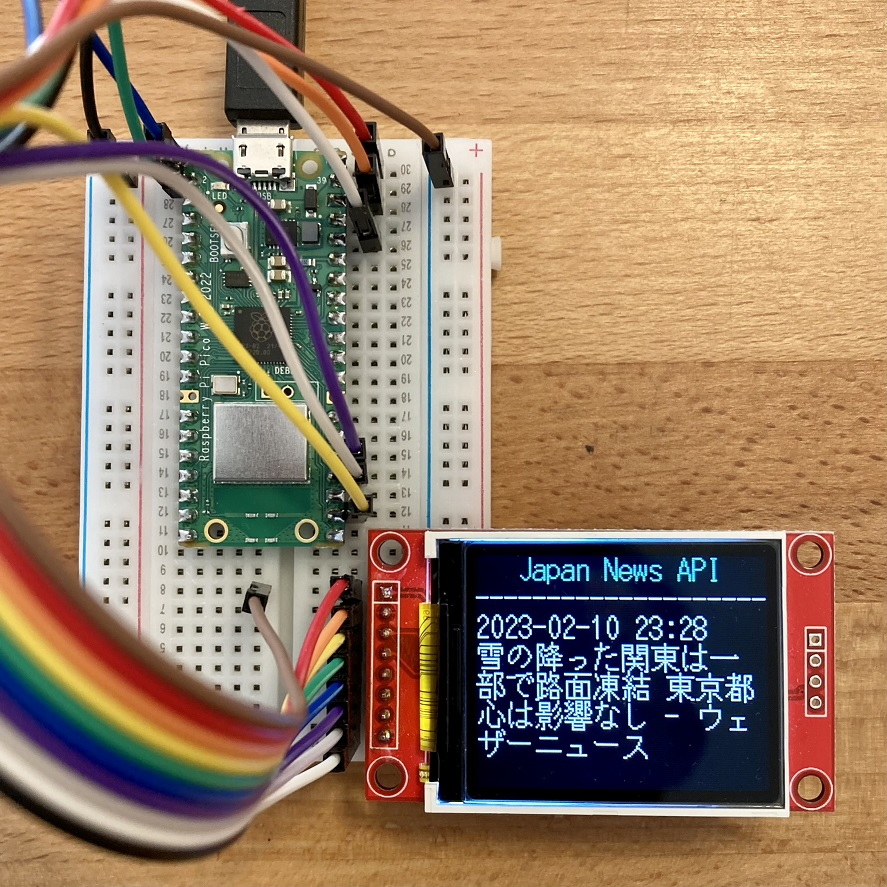
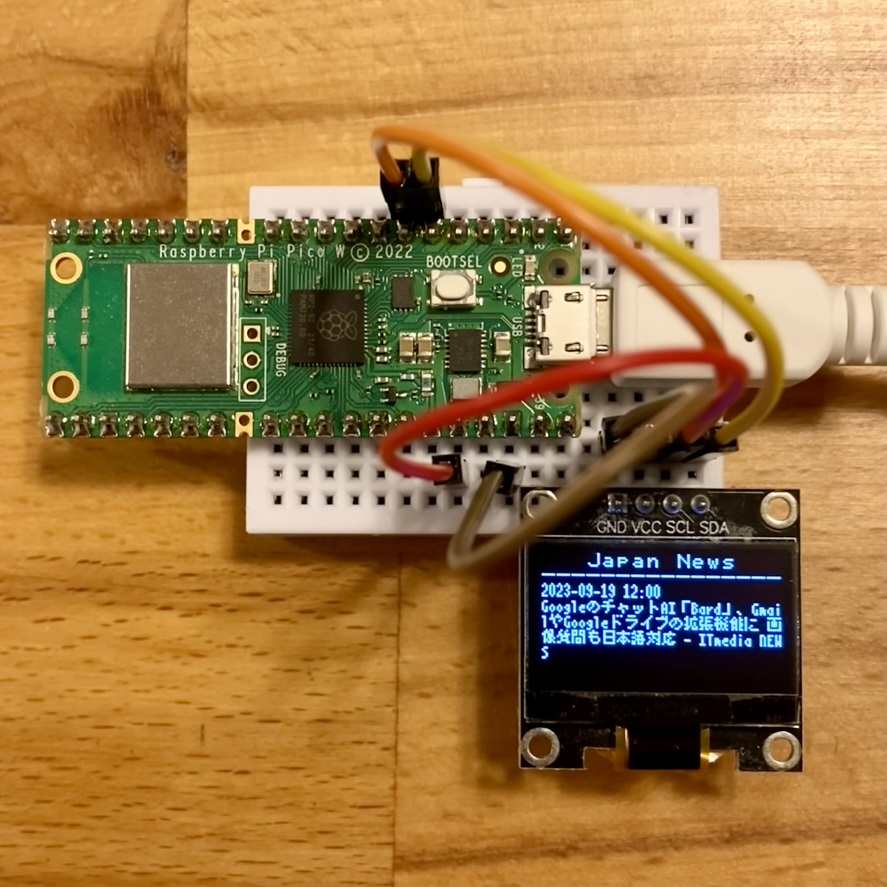
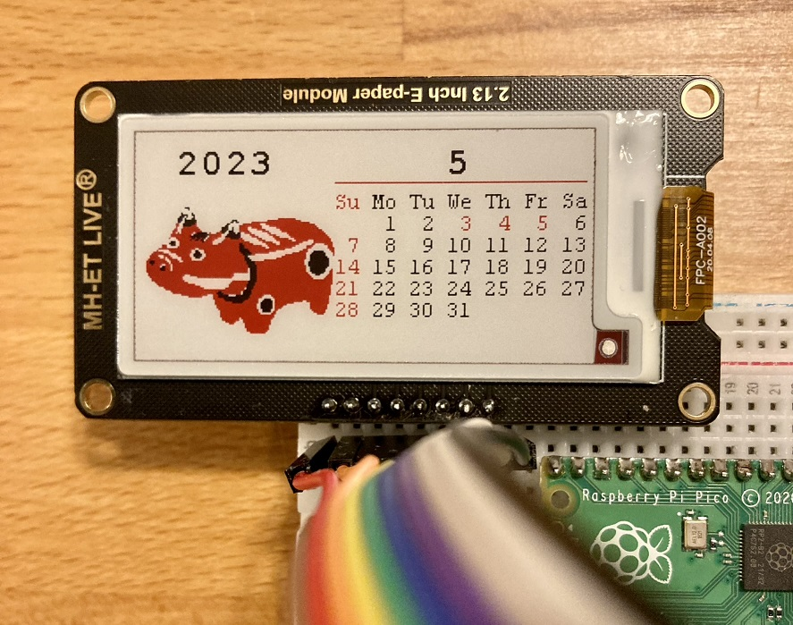

<!-- ABOUT THE PROJECT -->

# 1. プロジェクトについて

Raspberry Pi Pico を対象としたプロジェクトです。  
ここでは、実際に Raspberry Pi Pico で作成したプログラムを展開します。

(<a href="#readme-top">back to top</a>)

<!-- USAGE EXAMPLES -->

# 2. 使い方

Raspberry Pi Pico と Raspberry Pi Pico W を使ったプログラムを置いています。各プロジェクトにて詳細確認ください。

- Raspberry Pi Pico
  - ePaper : 電子ペーパーを使ったプロジェクト
  - GC9A01 : 1.28 インチ丸型ディスプレイを使ったプロジェクト
  - ST7735 : 1.8 TFT ST7735 128x160 を使ったプロジェクト
  - ST7735S : 0.96 OLED 80x160 ST7735S を使ったプロジェクト
  - ST7735withCamera : CircuitPython を使用してカメラを使ったプロジェクト
  - ST7789withTouch : タッチパネル付きの TFT ST7789 を使ったプロジェクト
- Raspberry Pi Pico W
  - SSD1306withWiFi : 0.96 OLED に Japan News API を日本語で表示するプロジェクト
  - ST7735withWiFi : 1.8 TFT に Japan News API を日本語で表示するプロジェクト

(<a href="#readme-top">back to top</a>)

# 3. 参考

- [Raspberry Pi Pico Documentation](https://www.raspberrypi.com/documentation/microcontrollers/raspberry-pi-pico.html)

(<a href="#readme-top">back to top</a>)

