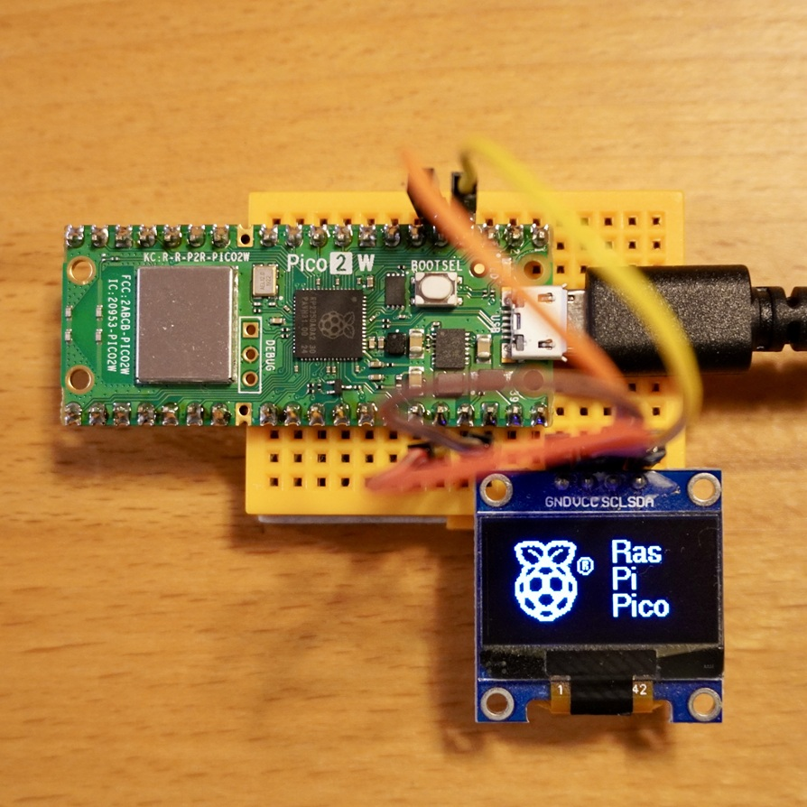
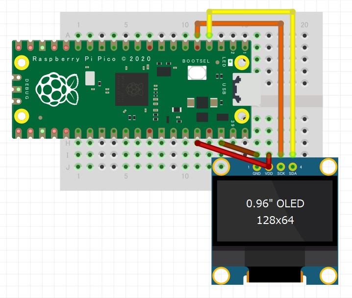

<!-- ABOUT THE PROJECT -->

# 1. プロジェクトについて

Raspberry Pi Pico 2 W を使って OLED 液晶ディスプレイの SSD1306 へ文字を表示するプロジェクトです。

(<a href="#readme-top">back to top</a>)

# 2. 環境構築

Raspberry Pi の公式ドキュメントを参考に環境を作成してください。

1. [Raspberry Pi Documentation](https://www.raspberrypi.com/documentation/microcontrollers/pico-series.html)
1. [Getting started with your Raspberry Pi Pico W](https://projects.raspberrypi.org/en/projects/get-started-pico-w)
1. [What is MicroPython?](https://www.raspberrypi.com/documentation/microcontrollers/micropython.html)

Pico 2 W に書き込む UF2 ファイルは 3 つ目のページにある"Pico 2 W"をクリックしてダウンロードしてください。「mp_firmware_unofficial_latest.uf2」という名前のファイルです。

Download the correct MicroPython UF2 file for your board:  
"Pico 2 W"

また Thonny のインストールなどは、親フォルダにある HowToUse も参考にしてください。

(<a href="#readme-top">back to top</a>)

# 3. Pin connections

| OLED | Pico |
| ---- | ---- |
| SDA  | GP4  |
| SCL  | GP5  |
| VCC  | 3V3  |
| GND  | GND  |

(<a href="#readme-top">back to top</a>)

# 4. プログラム

1. Thonny を開いて Pico 2 W と接続する
2. src フォルダにあるファイルを全て Pico 2 W へコピーする
3. Thonny の実行ボタンを押す

(<a href="#readme-top">back to top</a>)

# 5. 参考

(<a href="#readme-top">back to top</a>)

