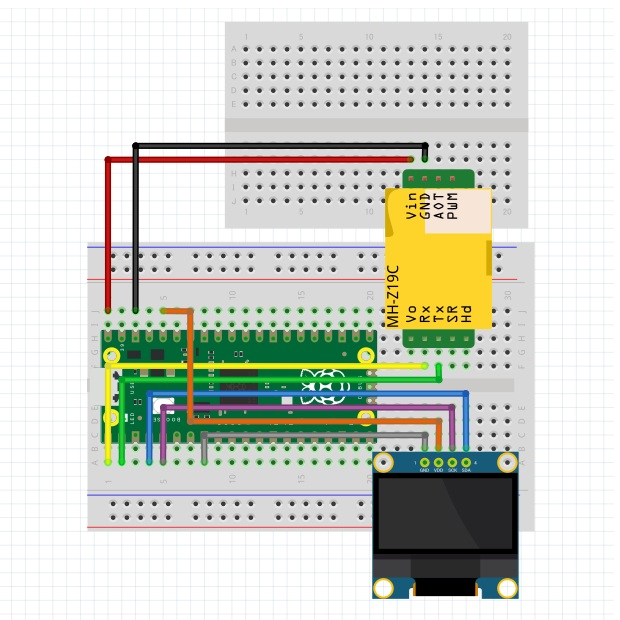

<!-- ABOUT THE PROJECT -->

# 1. プロジェクトについて

Raspberry Pi Pico 2 を使って、OLED 液晶ディスプレイの SSD1306 へ、CO2 センサー（MH-Z19C）から取得した値を表示するプロジェクトです。

  
  

(<a href="#readme-top">back to top</a>)

# 2. 環境構築

Raspberry Pi の公式ドキュメントを参考に環境を作成してください。

1. [Pico-series Microcontrollers](https://www.raspberrypi.com/documentation/microcontrollers/pico-series.html)
1. [Getting started with Raspberry Pi Pico](https://projects.raspberrypi.org/en/projects/getting-started-with-the-pico)
1. [What is MicroPython?](https://www.raspberrypi.com/documentation/microcontrollers/micropython.html)

Pico に書き込む UF2 ファイルは 3 つ目のページにあるリンクをクリックしてダウンロードしてください。

Download the correct MicroPython UF2 file for your board:

- Pico
- Pico W
- Pico 2
- Pico 2 W

また Thonny のインストールなどは、このフォルダの上位にある HowToUse も参考にしてください。

(<a href="#readme-top">back to top</a>)

# 3. Pin connections

| Pico | OLED |     | Pico | MH-Z19C |
| ---- | ---- | --- | ---- | ------- |
| GND  | GND  |     | VBUS | Vin     |
| 3V3  | VCC  |     | GND  | GND     |
| GP3  | SCL  |     | GP0  | Rx      |
| GP2  | SDA  |     | GP1  | Tx      |

(<a href="#readme-top">back to top</a>)

# 4. プログラム

1. Thonny を開いて Pico 2 と接続する
2. src フォルダにあるファイルを全て Pico 2 へコピーする
3. Thonny の実行ボタンを押す

(<a href="#readme-top">back to top</a>)

# 5. 参考

(<a href="#readme-top">back to top</a>)

詳細は「docs/mh-z19c.pdf」を参照ください。  
Preheat time（予熱時間）は 1 分ですので、その後、正確な値が取得できます。電源を用いた場合、この間は値が更新されません。

