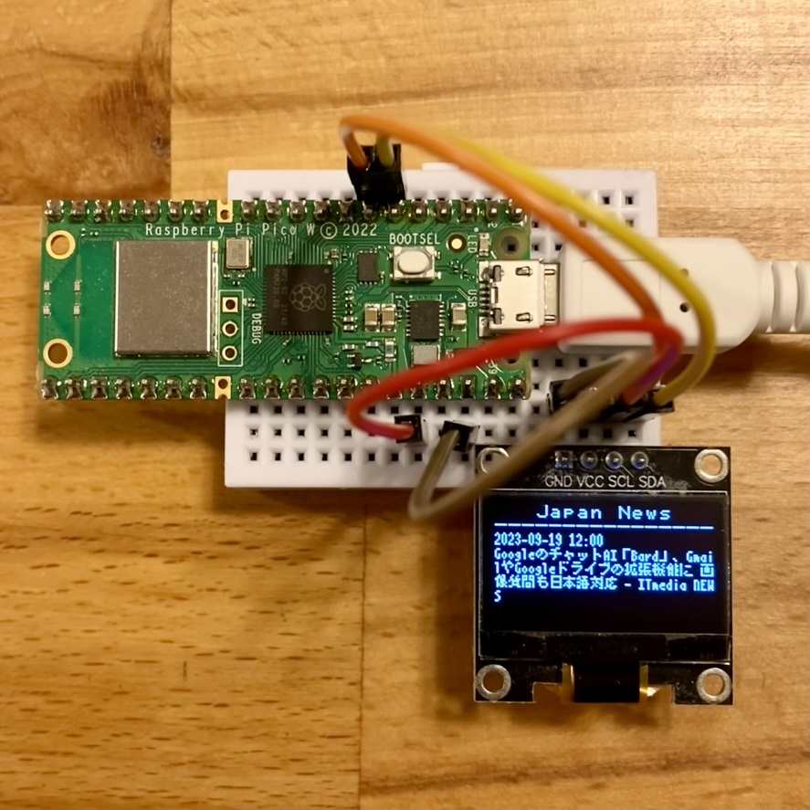
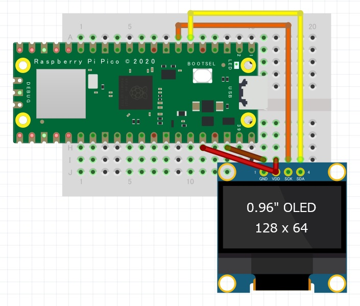

<!-- ABOUT THE PROJECT -->

# 1. プロジェクトについて

Raspberry Pi Pico W の WiFi を使って News API でニュースを取得し、
OLED 液晶ディスプレイの SSD1306 へ表示するプロジェクトです。  
Arduino IDE を使用して、スケッチを作成しています。

取得した日本語のニュースのタイトルは、フリーの日本語漢字ビットマップフォント、美咲フォントで表示しています。
美咲フォントの表示は以下のプロジェクトを参考に作成しています。ありがとう。

- mgo-tec/ESP32_SPIFFS_UTF8toSJIS  
  https://github.com/mgo-tec/ESP32_SPIFFS_UTF8toSJIS

- 8×8 ドット日本語フォント「美咲フォント」  
  https://littlelimit.net/misaki.htm

(<a href="#readme-top">back to top</a>)

# 2. Arduino IDE

- Arduino IDE [ツール]の指定  
  ボード：Raspberry Pi Pico W

  Boards Manager への追加はこちらを参考にしてください。  
  https://github.com/earlephilhower/arduino-pico/

- スケッチ例  
  Adafruit SSD1306 - ssd1306_128x64_i2c  
  SCREEN_ADDRESS は 0x3C の場合があります。

(<a href="#readme-top">back to top</a>)

# 3. Pin connections

| OLED | Pico |
| ---- | ---- |
| SDA  | GP4  |
| SCL  | GP5  |
| VCC  | 3V3  |
| GND  | GND  |

(<a href="#readme-top">back to top</a>)

# 4. 環境構築

1. Boards Manager へ arduino-pico を追加
1. ツールのボードは"Raspberry Pi Pico W"を選択
1. ツールの Flash Size は"2MB(Sketch: 1MB, FS: 1MB)"を選択
1. Pico LittleFS Filesystem Uploader をインストール
1. ツールの Pico LittleFS Data Upload で data をコピー
1. News API でアカウントを登録し API key を入手する
1. NewsAPI.ino の STASSID、STAPSK、NewsAPIURL を変更する
1. スケッチの書き込み装置を使って書き込む
1. サンプル画像とニュースが表示されます

## 4.1. 補足

- Flash Size FS: 1MB に設定する理由は、美咲フォントのサイズが大きいためです

# 5. 参考

- [Raspberry Pi Pico を Arduino IDE から使う方法](https://garchiving.com/use-raspberry-pi-pico-with-arduino-ide)
- [8×8 ドット日本語フォント「美咲フォント」](https://littlelimit.net/misaki.htm)
- [ESP32-WROOM-32 の SPIFFS を使って、日本語漢字 美咲フォント を読み込む](https://www.mgo-tec.com/blog-entry-spiffs-esp-wroom-32-misaki-font.html)
- [arduino-pico](https://github.com/earlephilhower/arduino-pico)  
  libraries の配下の中にある examples にサンプルコードがあります。
- [Arduino Pico LittleFS Filesystem Uploader](https://github.com/earlephilhower/arduino-pico-littlefs-plugin)  
  data フォルダのフォントファイルとサンプル画像をコピーするツールです。
- [News API](https://newsapi.org)

(<a href="#readme-top">back to top</a>)

