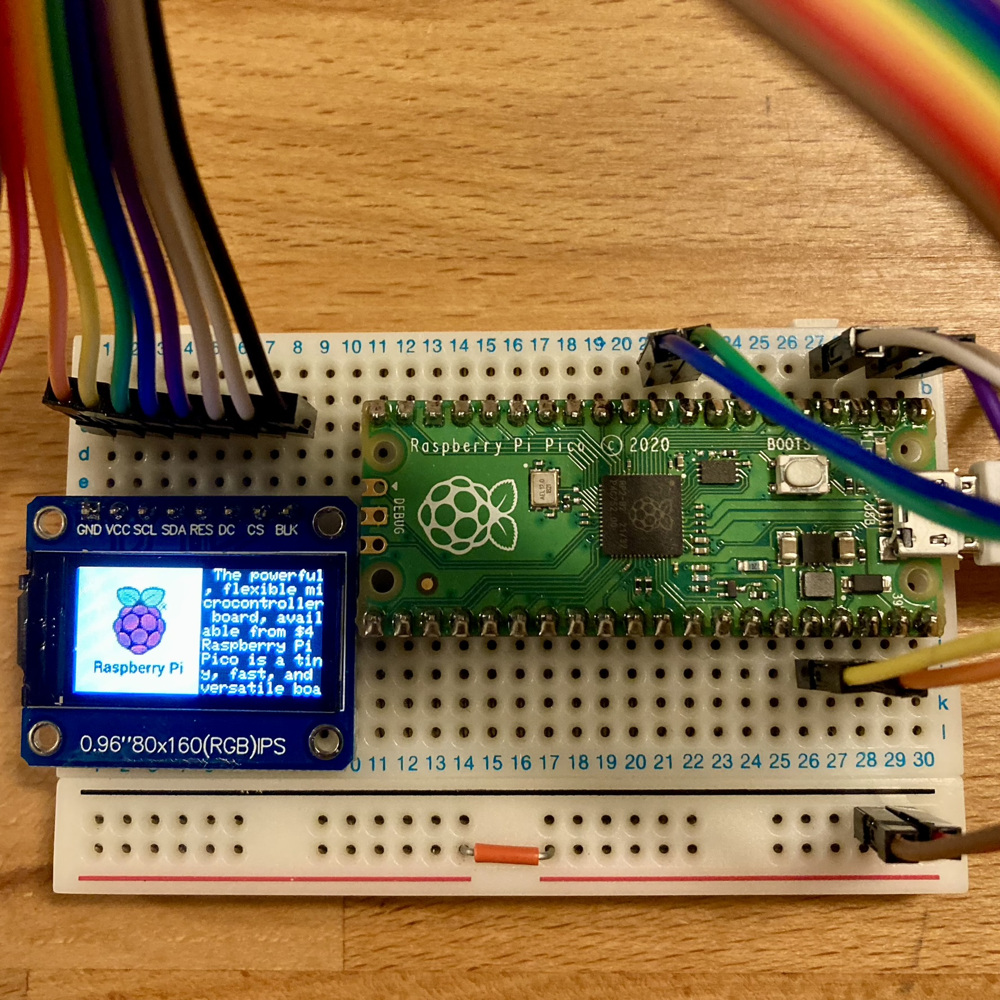

<!-- ABOUT THE PROJECT -->

# 1. プロジェクトについて

Raspberry Pi Pico で OLED 液晶ディスプレイの ST7735S へ表示するプロジェクトです。

(<a href="#readme-top">back to top</a>)

# 2. Pin connections

(<a href="#readme-top">back to top</a>)

# 3. 参考

- [Raspberry Pi Documentation](https://www.raspberrypi.com/documentation/microcontrollers/raspberry-pi-pico.html)
- [Getting started with Raspberry Pi Pico](https://projects.raspberrypi.org/en/projects/getting-started-with-the-pico/)

(<a href="#readme-top">back to top</a>)

