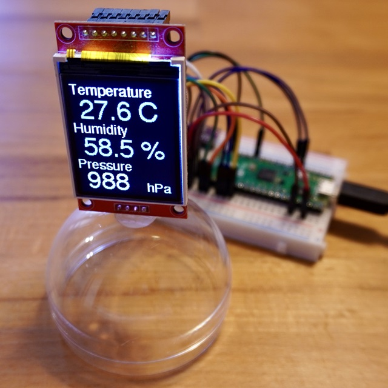
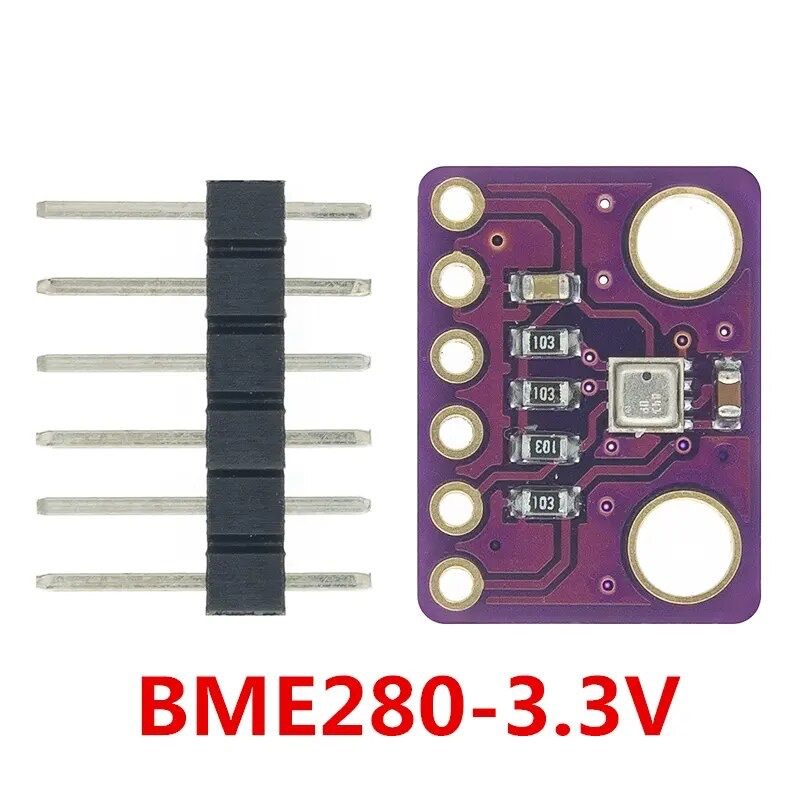
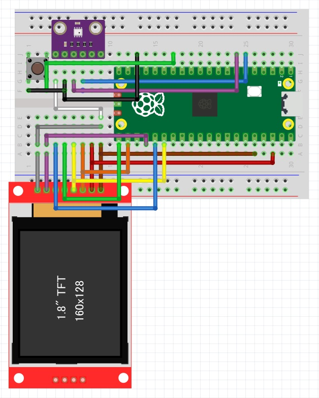
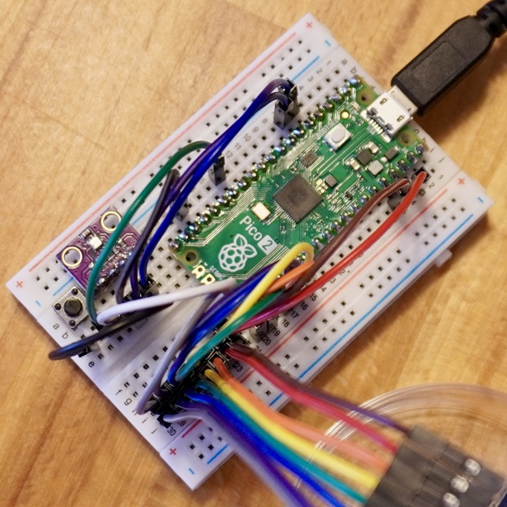
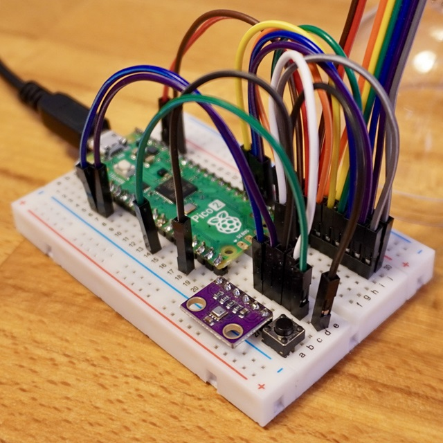
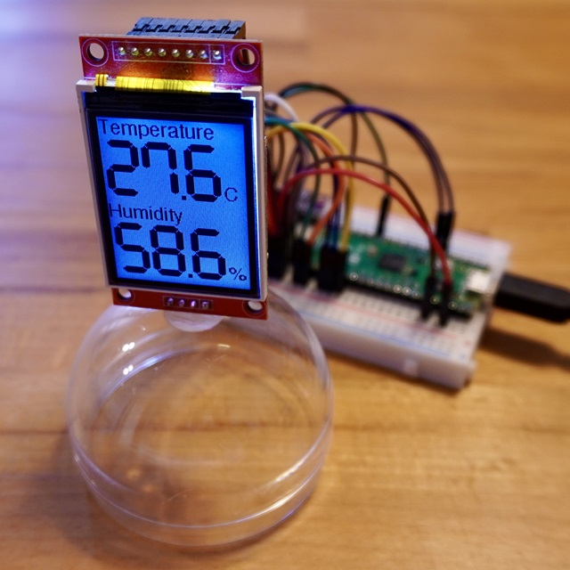

<!-- ABOUT THE PROJECT -->

# 1. プロジェクトについて

Raspberry Pi Pico 2 を使って TFT 液晶ディスプレイ（ST7735）へ表示するプロジェクトです。  
高精度なボッシュ社の BME280 を搭載したセンサモジュールで、  
温度、湿度、気圧の 3 つの環境情報を同時に測定し、ディスプレイへ測定値を表示します。  
画面は 1 秒周期で更新しており、ボタンを押すと画面が切り替わります。  
（Raspberry Pi Pico でも使用可能です）

(<a href="#readme-top">back to top</a>)

# 2. Arduino IDE

- Arduino IDE [ツール]の指定  
  ボード：Raspberry Pi Pico 2 若しくは Raspberry Pi Pico

- スケッチ例  
  Adafruit ST7735 and ST7789 Library - graphicstest  
  Adafruit BME280 Library - bme280test

(<a href="#readme-top">back to top</a>)

# 3. Pin connections

| TFT       | RasPi |     | BME280 | RasPi |     | BTN | RasPi |
| --------- | ----- | --- | ------ | ----- | --- | --- | ----- |
| LED       | 3V3   |     | VCC    | 3V3   |     | A   | GP10  |
| SCK       | GP18  |     | GND    | GND   |     | B   | GND   |
| SDI(MOSI) | GP19  |     | SCL    | GP5   |     |     |       |
| DC        | GP16  |     | SDA    | GP4   |     |     |       |
| RESET     | GP20  |     |        |       |     |     |       |
| CS        | GP17  |     |        |       |     |     |       |
| GND       | GND   |     |        |       |     |     |       |
| VCC       | 3V3   |     |        |       |     |     |       |

(<a href="#readme-top">back to top</a>)

# 4. 環境構築

1. Boards Manager へ arduino-pico を追加
1. ツールのボードは"Raspberry Pi Pico 2"を選択

Boards Manager への追加はこちらを参考にしてください。  
https://github.com/earlephilhower/arduino-pico/

(<a href="#readme-top">back to top</a>)

# 5. 画像

(<a href="#readme-top">back to top</a>)

# 6. 参考

- [Raspberry Pi Pico を Arduino IDE から使う方法](https://garchiving.com/use-raspberry-pi-pico-with-arduino-ide/)
- [arduino-pico](https://github.com/earlephilhower/arduino-pico/)  
  libraries の配下の中にある examples にサンプルコードがあります。

(<a href="#readme-top">back to top</a>)

