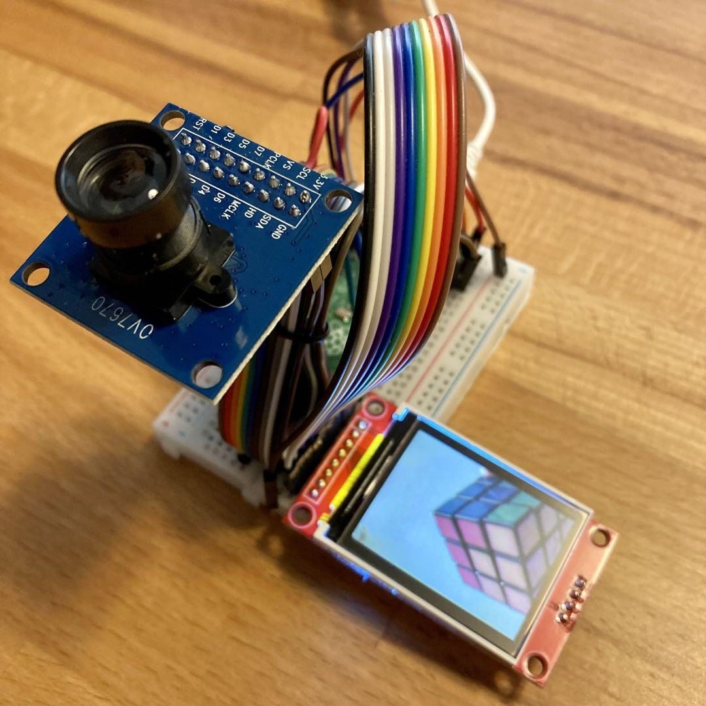
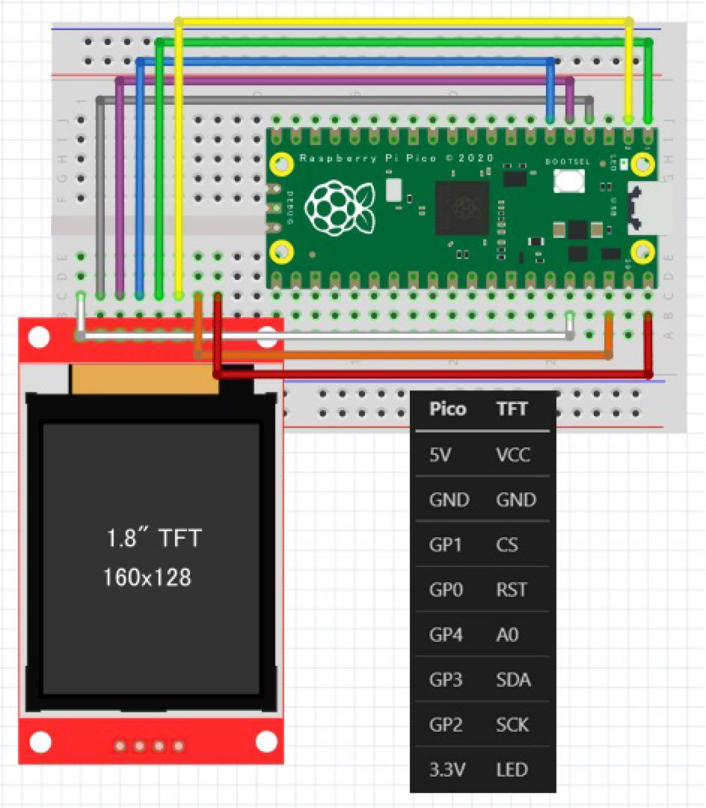
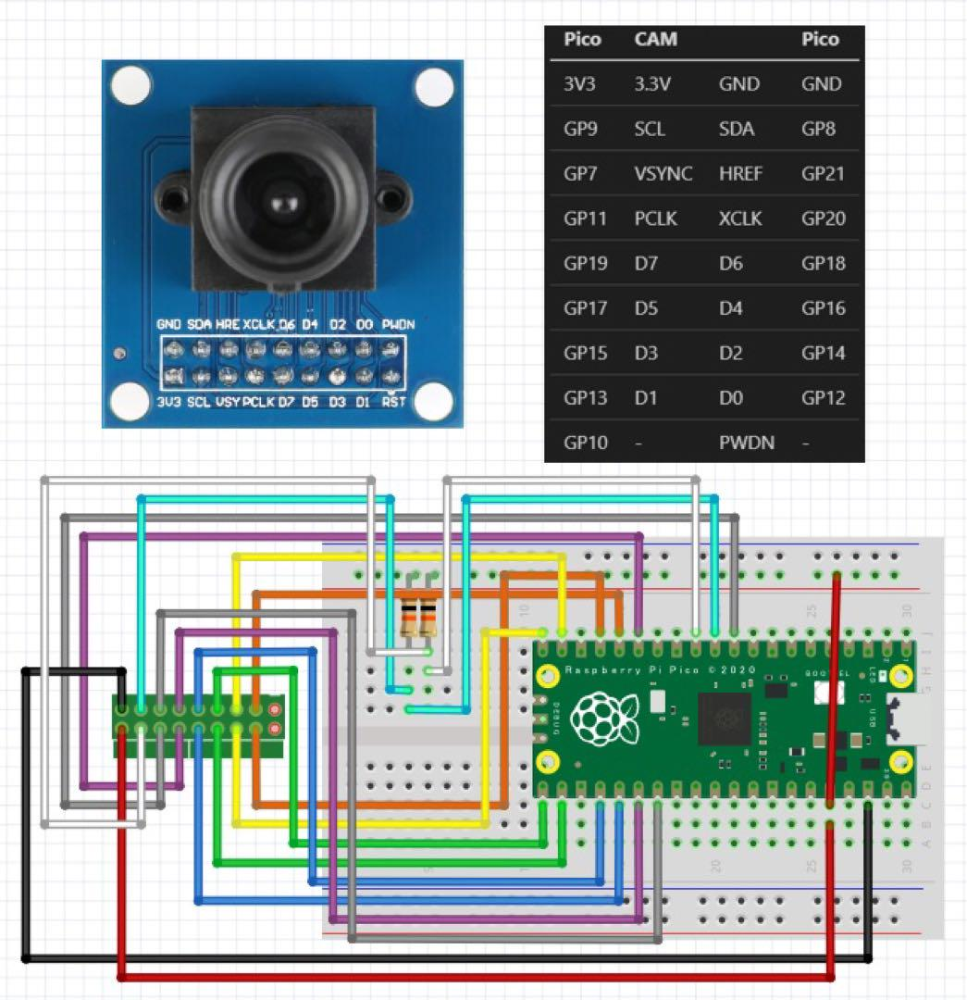
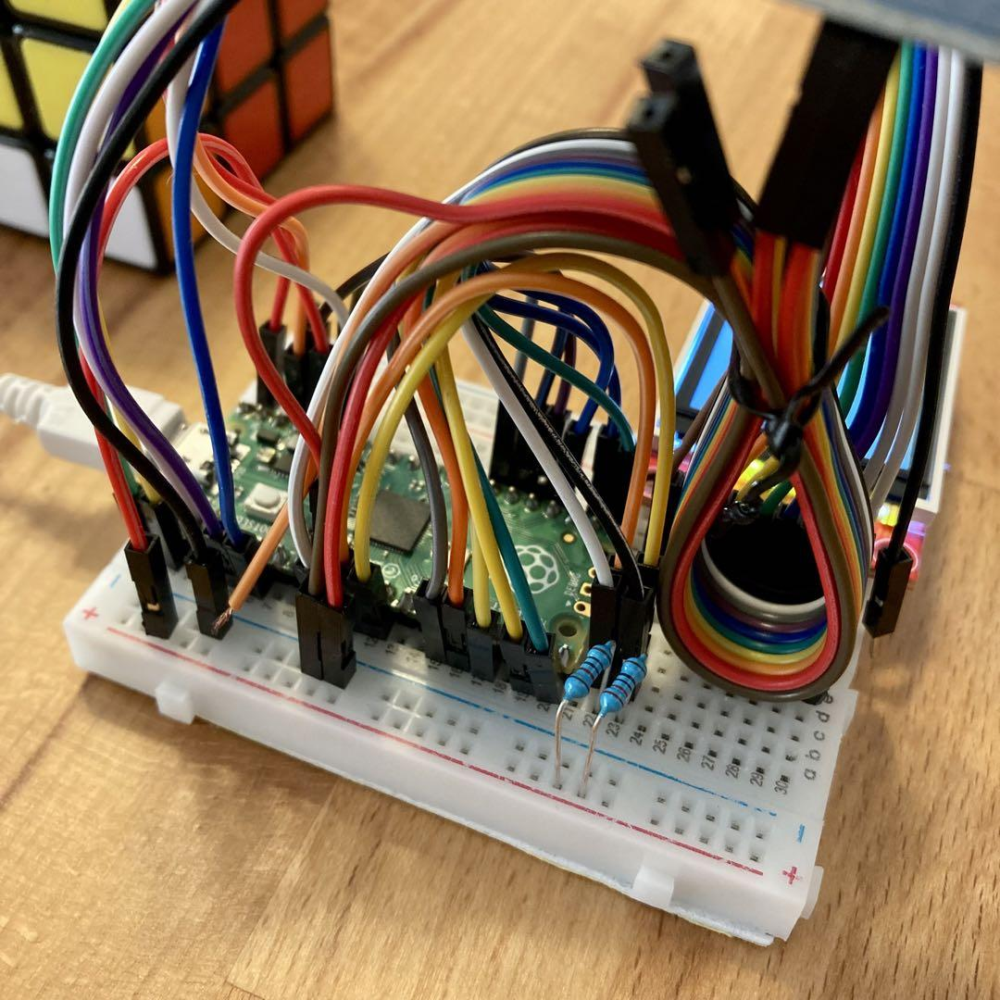
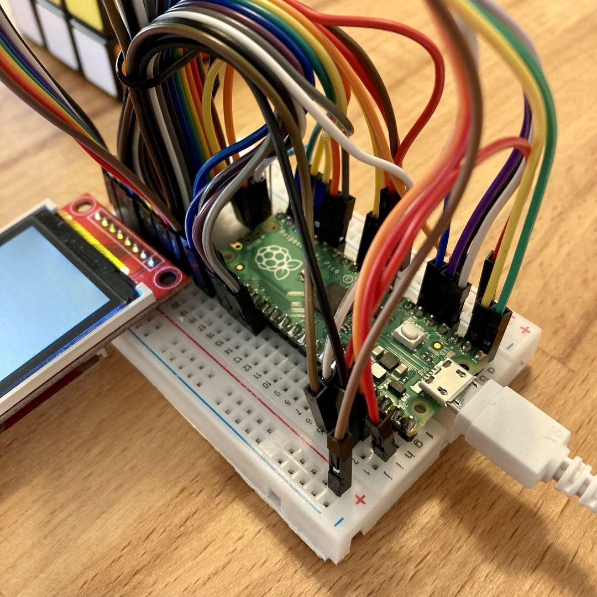

<!-- ABOUT THE PROJECT -->

# 1. プロジェクトについて

Raspberry Pi Pico で カメラから取得した画像を液晶ディスプレイ ST7735 へ表示するプロジェクトです。  
CircuitPython を使用しています。

(<a href="#readme-top">back to top</a>)

# 2. 配線図

(<a href="#readme-top">back to top</a>)

# 3. 参考

- [CircuitPython](https://circuitpython.org/board/raspberry_pi_pico/)
- [Raspberry Pi Pico ST7735 display tutorial](https://www.youtube.com/watch?v=KaGHxvVnKQ4&t=2s)
- [ov7670 + ST7789 (IPS Display) on Raspberry Pi](https://www.youtube.com/watch?v=Ld3W9UmPRHc)
- [ov7670/ov2640 + ST7789 (IPS Display) on Raspberry Pi](https://helloraspberrypi.blogspot.com/2021/08/ov7670-camera-st7789-ips-display-on.html)

(<a href="#readme-top">back to top</a>)

# 4. サンプルコード

Adafruit から以下のサンプルコードが出ているので、ST7789 の設定を ST7735 用に変更すると表示できます。

https://github.com/adafruit/Adafruit_CircuitPython_OV7670/blob/main/examples/ov7670_displayio_pico_st7789_2in.py

(<a href="#readme-top">back to top</a>)

# 5. その他

(<a href="#readme-top">back to top</a>)

