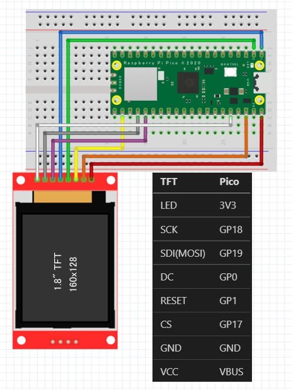

<!-- ABOUT THE PROJECT -->

# 1. プロジェクトについて

Raspberry Pi Pico W の WiFi を使って News API でニュースを取得し、
TFT 液晶ディスプレイの ST7735 へ表示するプロジェクトです。  
Arduino IDE を使用して、スケッチを作成しています。

取得した日本語のニュースのタイトルは、フリーの日本語漢字ビットマップフォント、東雲フォントで表示しています。
東雲フォントの表示は以下のプロジェクトを参考に作成しています。ありがとう。

mgo-tec/ESP32_SPIFFS_UTF8toSJIS  
https://github.com/mgo-tec/ESP32_SPIFFS_UTF8toSJIS

東雲 ビットマップフォントファミリー  
http://openlab.ring.gr.jp/efont/shinonome/

(<a href="#readme-top">back to top</a>)

# 2. Arduino IDE

- Arduino IDE [ツール]の指定  
  ボード：Raspberry Pi Pico W

  Boards Manager への追加はこちらを参考にしてください。  
  https://github.com/earlephilhower/arduino-pico/

- スケッチ例  
  Adafruit ST7735 and ST7789 Library - graphicstest

(<a href="#readme-top">back to top</a>)

# 3. Pin connections

| TFT       | Pico |
| --------- | ---- |
| LED       | 3V3  |
| SCK       | GP18 |
| SDI(MOSI) | GP19 |
| DC        | GP0  |
| RESET     | GP1  |
| CS        | GP17 |
| GND       | GND  |
| VCC       | VBUS |

(<a href="#readme-top">back to top</a>)

# 4. 環境構築

1. Boards Manager へ arduino-pico を追加
1. ツールのボードは"Raspberry Pi Pico W"を選択
1. ツールの Flash Size は"2MB(Sketch: 1MB, FS: 1MB)"を選択
1. Pico LittleFS Filesystem Uploader をインストール
1. ツールの Pico LittleFS Data Upload で data をコピー
1. News API でアカウントを登録し API key を入手する
1. NewsAPI.ino の STASSID、STAPSK、NewsAPIURL を変更する
1. スケッチの書き込み装置を使って書き込む
1. サンプル画像とニュースが交互に表示されます

## 4.1. 補足

- Flash Size FS: 1MB に設定する理由は、東雲フォントのサイズが大きいためです
- 東雲フォント shnmk16.bdf はサイズが大きいため、第１水準までにカットしています

# 5. 参考

- [Raspberry Pi Pico を Arduino IDE から使う方法](https://garchiving.com/use-raspberry-pi-pico-with-arduino-ide/)
- [東雲 ビットマップフォントファミリー](http://openlab.ring.gr.jp/efont/shinonome/)
- [日本語漢字ビットマップフォント、東雲フォントについて](https://www.mgo-tec.com/kanji-font-shinonome)
- [arduino-pico](https://github.com/earlephilhower/arduino-pico/)  
  libraries の配下の中にある examples にサンプルコードがあります。
- [Arduino Pico LittleFS Filesystem Uploader](https://github.com/earlephilhower/arduino-pico-littlefs-plugin)  
  data フォルダのフォントファイルとサンプル画像をコピーするツールです。
- [News API](https://newsapi.org/)

(<a href="#readme-top">back to top</a>)

