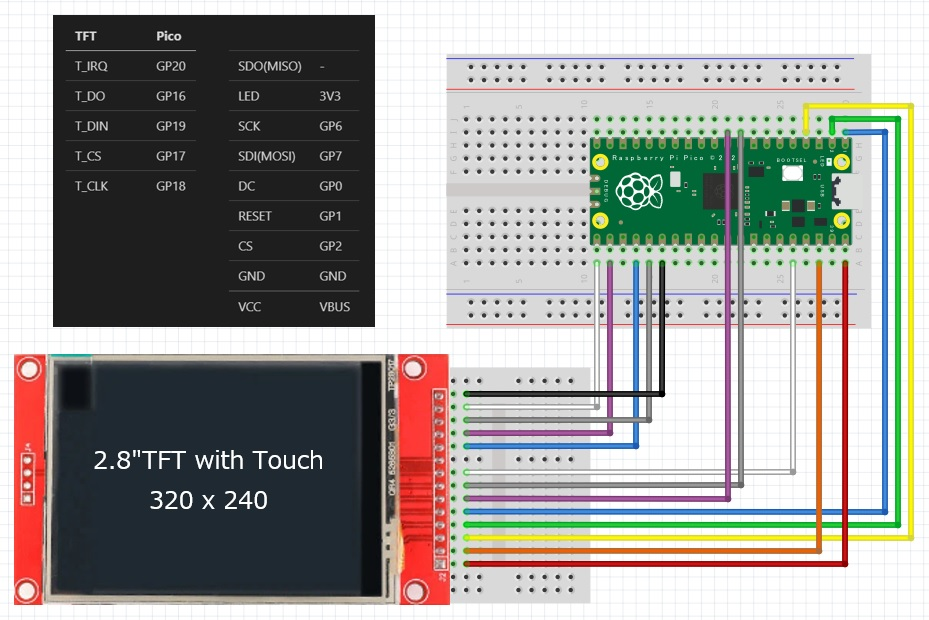
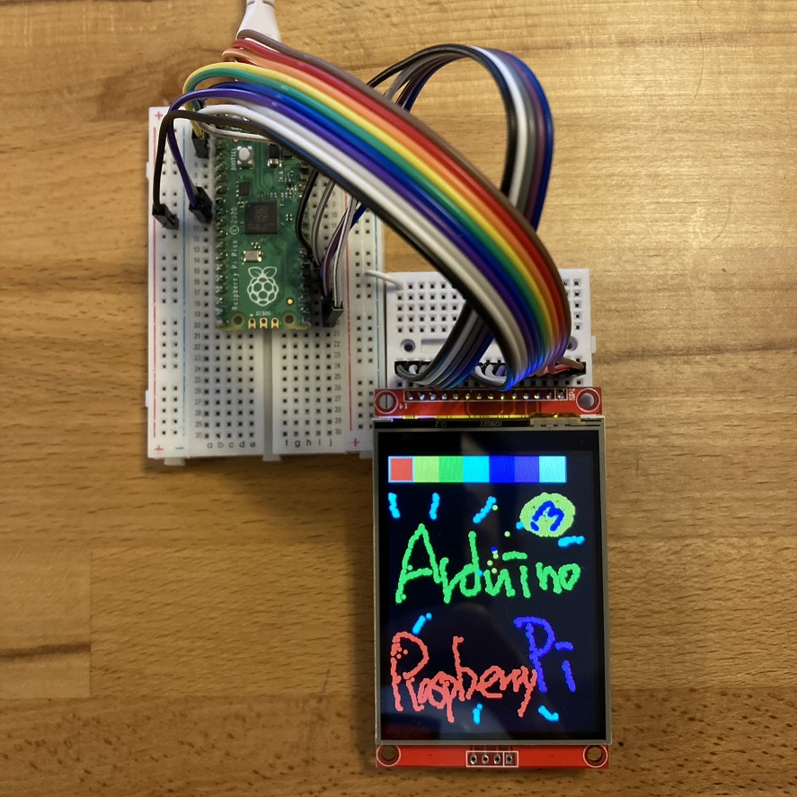

<!-- ABOUT THE PROJECT -->

# 1. プロジェクトについて

TFT のドライバ IC が ST7789 、タッチパネルが XPT2046 を対象としたプロジェクトです。  
Arduino IDE を使用して、スケッチ例 Adafruit ILI9341 の touchpaint を元に作成しています。

|              | 本プロジェクト | Adafruit ILI9341 |
| ------------ | -------------- | ---------------- |
| ドライバ IC  | ST7789         | ILI9341          |
| タッチパネル | XPT2046        | STMPE610         |

タッチパネル XPT2046 のソースコードは Paul Stoffregen が作成されたものを使用しています。ありがとう。

(<a href="#readme-top">back to top</a>)

# 2. Arduino IDE

- Arduino IDE [ツール]の指定  
  ボード：Raspberry Pi Pico

- スケッチ例  
  Adafruit ST7735 and ST7789 Library - graphicstest  
  Adafruit ILI9341 - touchpaint

(<a href="#readme-top">back to top</a>)

# 3. Pin connections

| TFT       | Pico |
| --------- | ---- |
| T_IRQ     | GP20 |
| T_DO      | GP16 |
| T_DIN     | GP19 |
| T_CS      | GP17 |
| T_CLK     | GP18 |
| SDO(MISO) | -    |
| LED       | 3V3  |
| SCK       | GP6  |
| SDI(MOSI) | GP7  |
| DC        | GP0  |
| RESET     | GP1  |
| CS        | GP2  |
| GND       | GND  |
| VCC       | VBUS |

(<a href="#readme-top">back to top</a>)

# 4. 参考

- [2.8" TFT Touch Shield for Arduino with Resistive Touch Screen](http://www.adafruit.com/products/1651)
- [PaulStoffregen/XPT2046_Touchscreen](https://github.com/PaulStoffregen/XPT2046_Touchscreen)

## 4.1. お絵描きアプリ

(<a href="#readme-top">back to top</a>)

