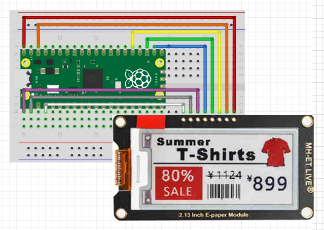
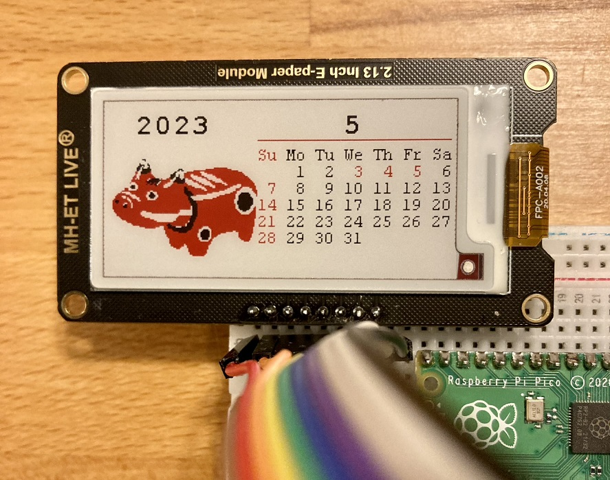

<!-- ABOUT THE PROJECT -->

# 1. プロジェクトについて

Raspberry Pi Pico で 電子ペーパー MH-ET LIVE E-paper 2.13 Inch へ表示するプロジェクトです。  
Arduino IDE を使用して、スケッチを作成しています。

- MH-ET LIVE E-paper 2.13 Inch 212x104
  

Waveshare から提供されている e-Paper のサンプルコード epd2in13b_V4 をベースに作成しています。

waveshare / e-Paper  
https://github.com/waveshare/e-Paper

オリジナルからの変更点は以下です。

- ピンアサイン
- 表示用バッファサイズ（4 倍にして黒赤 2 面用意）
- Epd::DisplayAll()の作成（黒赤を各 1 回で表示）
- Paint::SetRotate()への対応（バッファを大きくして回転時の座標計算を不要に）

(<a href="#readme-top">back to top</a>)

# 2. Arduino IDE

- Arduino IDE [ツール]の指定  
  ボード：Raspberry Pi Pico

  Boards Manager への追加はこちらを参考にしてください。  
  https://github.com/earlephilhower/arduino-pico/

- スケッチ例  
  Adafruit ST7735 and ST7789 Library - graphicstest

(<a href="#readme-top">back to top</a>)

# 3. Pin connections

| ePaper | Pico |
| ------ | ---- |
| Busy   | GP2  |
| Reset  | GP1  |
| D/C    | GP0  |
| CS     | GP17 |
| SCLK   | GP18 |
| SDI    | GP19 |
| GND    | GND  |
| VCC    | VBUS |

(<a href="#readme-top">back to top</a>)

# 4. 環境構築

1. Boards Manager へ arduino-pico を追加
1. ツールのボードは"Raspberry Pi Pico"を選択
1. ツールの Flash Size は"2MB(no FS)"を選択
1. スケッチの書き込み装置を使って書き込む
1. 図形とサンプル画像が表示されます

# 5. 参考

- [arduino-pico](https://github.com/earlephilhower/arduino-pico/)
- [2.13inch e-Paper HAT (B) Manual](<https://www.waveshare.com/wiki/2.13inch_e-Paper_HAT_(B)_Manual>)

## 5.1. 画像

(<a href="#readme-top">back to top</a>)

